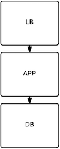
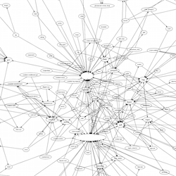

layout: true
class: middle, inverse
---

# It's all about the name
### (aka where is that thing again?)

---

# Intro

---

## Who am i?

- Bo 
- Ex Physicist/Chemist
    - (aka i like structure, patterns, and statistics)
- you won't find me on twitter

---

# What are we talking about?

---

## What this talk is not

- about super fancy salt modules

.p-dim[(well ok there are a few of those..., maybe not fancy)]

---

## What this is about

- A formalism (with salt as implementor)

---

# MFP

---

## About

- no we're not google size (how many people are in your Company?).
- 10s of millions of users
- Many TBs of Data
- Largest Food related data around
- Adding TBs of transactional Data per day
- currently serving peak 15k TPS, increasing 30-50% year over year
- Many Millions of daily users

---

## One year ago


---


---

## Tomorrow

- .... MMF + Endomondo + UA Record ... 
    
    - (we ain't getting any smaller)

---

# DevOps?

---

## What Ops wants

---


## What Ops wants

control

---

## What Devs want

---

## What Devs want

control
---

## What ops typically does not want to give Devs

control

---

## DevOps 
### "Giving Devs the illusion of control" &trade;


---

# How did we get here?

  .large[&#8649;]  

---

# What does Ops want 
### .p-dim[(what i want)]

- isolation
- access control
- easily failure points finding
     - (where is that damned server again?)
- let devs control their own fates 

---

# what Devs want

- "to install everything"
- "access to everything"

---

# so there's docker/(rocket?)

---

# hmm?

- Networking: GRE tunnels, sure OpenvSwitch 
    - - (YANL) "yet-another-network-layer"
- VM: this is AWS .. not bare metal
- Security: do you know what's on a docker image?
---

# skip that .. 

- how fast do you need to move?

---
    
# i like the shell

- "grep|ls|mkdir|cat|echo"
- 'do one thing and do it well'
    - does 'grep' need a Database? (yes, but .....)

---

# so back to the "today"

- Micro-services = "unix-ism"
- let's do that
- we deploy ~1-5 new service stacks per week

---

# service "stack"?
- the app
- the Data infra (DBs, caches, etc)
- the monitoring infra
- the security infra
- service discovery
- load balencers
- "credentials" (aka the creds)

---

# that's alot of software
yes, it is

---

# that's alot of software
how many things are in your `/usr/bin/`?
hundreds? thousands?

---

# that's alot of "clusters"
yes it is

---

# that's alot of "clusters"
how many debains/rpms are installed?
hundreds? thousands?

---


---

#  ... so there's a problem ... 
- isolation
- access controll
- easily failure points
    - where is that damned server again?
- creds        
 
---
       
## The Quad

### ENV-CLASS-TYPE-ROLE

---

## Environment

- prod
- integ
- dev
- load
- ...

---

## Class

- app
- db
- tools
- infra
- build
- lb
- ...
    
---

## Type

- service
- redis
- mongo
- mysql
- ...

---

## Roles

- "grep"
- "ls"
- "mkdir"

---

## Roles

- "food"
- "user"
- "steps"
- "diary"

---

## Examples

- prod-db-percona-food
- prod-app-service-user
- integ-db-elasticsearch-users
- prod-build-jenkins-mobilemaster
- prod-infra-docker-repo
- dev-lb-backend-web
    
---

## how many does mfp have now?

(as of today 450)

---

# Ok so we have a labeling scheme now what?

---

# Now What?

- what's it mean for salt?
- what's it mean for aws?
- what's it mean for access?
- what's it mean for creds?

---

# Salt

- ids
- states
- pillars

---

# Salt states

`auto`

---

# Salt states - `auto`

"state cascade"

---

# Salt states - `auto`

* all.sls
* env-prod.sls
* class-app.sls
* type-app-main.sls
* role-app-main-web.sls

---

# Salt states - `auto`

|  state | contents  |
|---|---|
| all.sls  | `include: - ldap`  |
| env-prod.sls  | `include: - python`  |
| class-app.sls |  `include: - deployer` |
| type-app-main.sls |  `include: - scala` |
| role-app-main-web.sls |  `include: - ruby` |

---

# Salt states - `auto`

|  state | contents  |
|---|---|
| all.sls  | `include: - ldap`  |
| env-prod.sls  | `include: - python`  |
| class-app.sls |  `include: - deployer` |
| type-app-main.sls |  `include: - scala` |
| role-app-main-web.sls |  `include: - ruby` |

.center[.large[&#8650;]]

```
include:
    - ldap
    - python
    - deployer
    - scala
    - ruby
```
---

# Salt states - `auto` - "env"

* class-app-integ.sls
* type-app-main-integ.sls
* role-app-main-web-integ.sls

---


# Salt pillars - `auto`

"pillar cascade" 

---

# Salt pillars - `auto`

* all.sls
* env-prod.sls
* class-app.sls
* type-app-main.sls
* role-app-main-web.sls

---

# Salt pillar - `auto`

|  pillar | contents  |
|---|---|
| all.sls  | `my_all_key: moo`  |
| env-prod.sls  | `prod_key: foo`  |
| class-app.sls |  `app_key: monkey` |
| type-app-main.sls |  `app_key: bar` |
| role-app-main-web.sls |  `main_key: houses` |

---

# Salt pillar - `auto`

|  pillar | contents  |
|---|---|
| all.sls  | `my_all_key: moo`  |
| env-prod.sls  | `prod_key: foo`  |
| class-app.sls |  `app_key: monkey` |
| type-app-main.sls |  `app_key: bar` |
| role-app-main-web.sls |  `main_key: houses` |

<center class="large">&#8650;</center>

```
my_all_key: moo
prod_key: foo
app_key: bar  # yes there are overrides
main_key: houses
```

---

# Salt pillar - `auto` - "env"
(yep same as states)

* class-app-integ.sls
* type-app-main-integ.sls
* role-app-main-web-integ.sls

---

# Now What?

- .dim[what's it mean for salt?]
- .bolded[what's it mean for aws?]
- .p-dim[what's it mean for access?]
- .p-dim[what's it mean for creds?]

---

# AWS - IAM

each quad gets an IAM ROLE

* S3 permissions (w/o keys/ids)
* Snapshot permissions
* etc

---

# AWS - SecurityGroups

each quad a standard set

* e-{ENV}
* c-{ENV}-{CLS}
* t-{ENV}-{CLS}-{TYPE}
* r-{ENV}-{CLS}-{TYPE}-{ROLE}

---

# AWS - DomainNames

each quad a standard dns name

* {ROLE}-[INDEX]-{TYPE}-{CLS}-{ENV}.[root-d]

---

# AWS - DomainNames

each quad a standard dns name

* web-1-main-app-prod.mfpaws.com

---

# Now What?

- .dim[what's it mean for salt?]
- .dim[what's it mean for aws?]
- .bolded[what's it mean for access?]
- .p-dim[what's it mean for creds?]

---

# Access - LDAP

- we use SSSD + ldap for ssh/sudo access
- each server gets an "allowed" group for things
    - {ENV}
    - {ENV}-{CLS}
    - {ENV}-{CLS}-{TYPE}
    - {ENV}-{CLS}-{TYPE}-{ROLE}
- Folks in those groups get ssh access

---

# Now What?

- .dim[what's it mean for salt?]
- .dim[what's it mean for aws?]
- .dim[what's it mean for access?]
- .bolded[what's it mean for creds?]

---

# Creds 

- Yes there are "pillars" we could use
- Security: very few folks get access to that

---

# Creds - `credo`

- pillar module which pulls key/values from a DB

(more on that later)

---

# Putting it all together

SaltCubes

---

# SaltCubes

Something has to do all the legwork ... 

- Creds
- Profiles (Provisioning/EC2 stuff)
- Services
- Connections
- .... some more stuff ....

---

## SaltCubes - Creds


---

## SaltCubes - Creds

This can/does maps to a few things 

- Zookeeper JSON blob (keyed by Minion ID)
- etcd JSON blob (keyed by Minion ID)
- one json file (on host)
- little tiny files of things (on host)
- (whatever else really .. redis, memcache, blaa blaa)

```
    # ls etc/creds/auto/
     ... ctr
     ... role
     ... env
     ... type
     ... class
     ... quad
     ... index_id
```

---

## SaltCubes - Creds

Hierarchical cascade

```
    *
    *-*
    *-*-*
    *-*-*-prod
    app-*
    app-prod
    app-main-*
    app-main-prod
    app-main-web-*
    app-main-web-prod
```


---

## SaltCubes - Launcher

(salt-cloud, but not)


---

## SaltCubes - Launcher - Services

(service discovery of a kind)

[name] - [port] - [other/healthchecks/limits, etc]

---

## SaltCubes - Launcher - Services


---

## SaltCubes - Launcher - Services

services are CTR based (i.e. a triple)

{CLS}-{TYPE}-{ROLE}

"transend environments"

.bolded[WHY?]

---

## SaltCubes - Launcher - Services

proper integration testing 

---

## SaltCubes - Launcher - Connections

Service to Service

---

## SaltCubes - Launcher - Connections

Meaning .... 

---

## SaltCubes - Launcher - Connections

In AWS it means a one thing

- "i would like to open port XXX to NNN security group please" 

(on our recipe service loadbalencer  `prod-lb-backend-recipe`)


---

## SaltCubes - Launcher - Connections

In AWS it means a one thing

- "i would like to open port XXX to NNN security group please" 

(the one of the recipe services in AWS ville `prod-app-recipe-parse`)


---

## SaltCubes - Dev access - creds 

They control their own creds (w/ access controls)


---

## SaltCubes - Dev access - creds


---

## SaltCubes - Dev access - EC2


---

## SaltCubes - Dev access - stats


---

## QUAD - recap


---

## Salt+Cubes - flow

.fit-height[]

---

# Questions?


